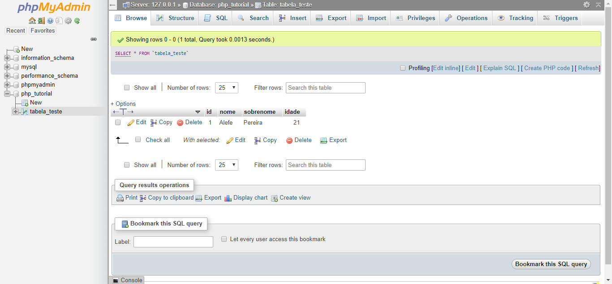

# PDO

Para acesso ao banco de dados utilizaremos o PDO, ou PHP Data Objects, que é a forma recomendada de acessar o banco de dados pelo PHP, normalmente quando se utiliza o MySQL como banco de dados, ensinam as funções do mysqli primeiro, deixando o PDO para pessoas mais experientes aprenderem depois (experiência própria...).

A principal vantagem do PDO é podermos acessar e executar queries SQL em nos principais banco de dados, não apenas o MySQL, de forma muito fácil e simples.

Para conectar no banco de dados do XAMPP, usaremos o seguinte código:

```php
$db_host = 'localhost';
$db_nome = 'php_tutorial';
$db_user = 'root';
$db_senha = '';

$conexao = new PDO("mysql:host=$db_host;dbname=$db_nome;charset=utf8", $db_user, $db_senha);
```

Note que as informações que colocamos acima são as mesma que colocamos no phpMyAdmin.

Vamos em seguidas fazer um CRUD utilizando o PDO.

## Create

Após isso, poderemos executar queries SQL, que é a forma mais comum de executar comandos em bancos de dados.

Por exemplos, caso queiramos inserir um dado na tabela `tabela_teste` que criamos pelo phpMyAdmin, podemos executar o seguinte comando:

```php
$conexao = new PDO('mysql:host=localhost;dbname=php_tutorial;charset=utf8', 'root', '');

$query = $conexao->prepare('INSERT INTO tabela_teste (nome, sobrenome, idade) VALUES (:nome, :sobrenome, :idade)');

$query->bindValue(':nome', 'Rasmus', PDO::PARAM_STR);
$query->bindValue(':sobrenome', 'Lerdorf', PDO::PARAM_STR);
$query->bindValue(':idade', 49, PDO::PARAM_INT);

$query->execute();
```

Inicialmente criamos nossa conexão com o banco de dados, então declaramos uma variável `$query` onde colocaremos nossa instrução SQL que queremos executar no banco, no caso é um INSERT na tabela `tabela_teste` que criamos no phpMyAdmin, note que a query possui os parâmetros :nome, :sobrenome e :idade, esses valores serão substituídos pelos bindValue no código logo em seguida.

Com o método bindValue podemos substituir parâmetros na nossa query SQL, no próximo parágrafo eu explico o por quê disso, no primeiro argumento colocando qual parâmetro queremos substituir, em seguida o seu valor, e depois o seu tipo, então usamos o comando para executar nossa query, que executará o seguinte comando no banco de dados:

```sql
INSERT INTO tabela_teste VALUES (nome, sobrenome, idade) VALUES ('Rasmus', 'Lerdorf', 49);
```

Fazendo os dados da nossa tabela ficar assim no phpMyAdmin:


A vantagem de usar o prepare com os bindValues é evitar o famoso [SQL Injection](https://www.tecmundo.com.br/tecmundo-explica/113195-sql-injection-saiba-tudo-ataque-simples-devastador.htm), que impede que usuários mal-intencionados tentem executar algum SQL ao preencher um formulário, o que não acontece caso você use concatenação diretamente.

## Read

Podemos fazer uma leitura de uma tabela com o seguinte comando:

```php
// teste.php

$conexao = new PDO('mysql:host=localhost;dbname=php_tutorial;charset=utf8', 'root', '');

$query = $conexao->prepare('SELECT * FROM tabela_teste');
$query->execute();

while ($linha = $query->fetch(PDO::FETCH_ASSOC)) {
    echo $linha['nome'] . ' ' . $linha['sobrenome'] . ', ' . $linha['idade'] . ' anos' . '<br>';
}
```

O código acima exibirá o seguinte o navegador:


O que ocorre é que fizemos um comando que seleciona todos os registros da tabela `tabela_teste`, a condição naquele `while` retorna a próxima linha da tabela cada vez que for executada, e põe o valos das colunas da mesma em um array chave-valor na variável `$linha`, com as chaves sendo o nome das colunas e o valor o valor da mesma coluna na linha atual, e quando não houver mais linhas, ela retorna falso, assim parando o `while`.

Poderíamos colocar o WHERE no SQL para retornar linhas mediante certa condição, podendo retornar dados só de uma pessoa ou fazer uma busca, caso queira saber mais sobre essas condições, [esse link](https://www.devmedia.com.br/sql-clausula-where/37645) possui uma boa explicação.

## Update

Podemos fazer uma atualização em um registro de uma tabela com o seguinte comando:

```php
$conexao = new PDO('mysql:host=localhost;dbname=php_tutorial;charset=utf8', 'root', '');

$query = $conexao->prepare('UPDATE tabela_teste SET sobrenome=:sobrenome WHERE id=:id');

$query->bindValue(':sobrenome', 'Pereira', PDO::PARAM_STR);
$query->bindValue(':id', 1, PDO::PARAM_INT);

$query->execute();
```

No final será executado o seguinte comando no banco de dados:

```sql
UPDATE tabela_teste SET sobrenome='Pereira' WHERE id=1;
```

Nesse caso utilizamos o comando UPDATE (atualizar) dizendo que queremos atualizar para "Pereira" o campo sobrenome do registro que possui o id igual a 1.

Após a execução desse comando, nosso phpMyAdmin ficará assim:


E a página teste.php ficará assim:


## Delete

Podemos fazer apagar um registro de uma tabela com o seguinte comando:

```php
$conexao = new PDO('mysql:host=localhost;dbname=php_tutorial;charset=utf8', 'root', '');

$query = $conexao->prepare('DELETE FROM tabela_teste WHERE id=:id');

$query->bindValue(':id', 2, PDO::PARAM_INT);

$query->execute();
```

No final será executado o seguinte comando no banco de dados:

```sql
DELETE FROM tabela_teste WHERE id=2;
```

Nesse caso utilizamos o comando DELETE (apagar) apagar o registro que possui o id igual a 2.

Após a execução desse comando, nosso phpMyAdmin ficará assim:



E a página teste.php ficará assim:


## Cuidado

Lembre-se sempre de utilizar o WHERE nos comandos UPDATE e DELETE, caso contrário, você atualizará ou apagará todos os registros da tabela.
