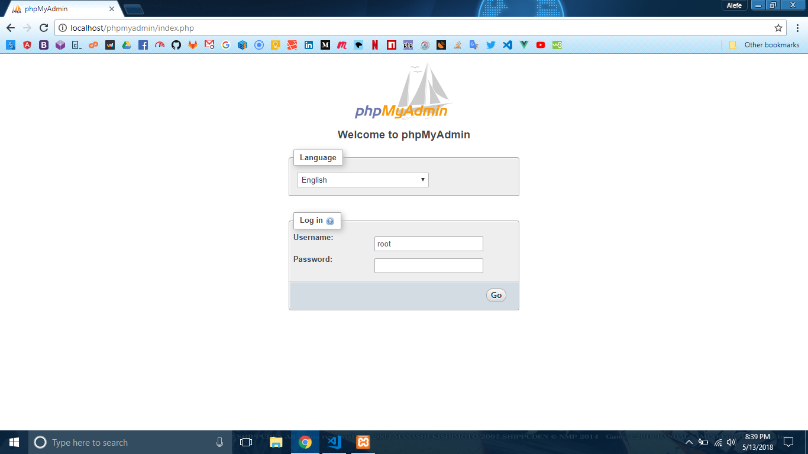

# phpMyAdmin

O phpMyAdmin é um ótimo painel escrito em PHP para você checar os dados de bancos de dados MySQL existentes e criar novos dados, ele é ótimo para utilizarmos enquanto estamos desenvolvendo.

Caso você tenha instalado o XAMPP com no mínimo as opções que deixei no screenshot a seguir:

Você conseguirá acessá-lo no endereço [http://localhost/phpmyadmin](http://localhost/phpmyadmin), caso apareça uma tela de login, o username padrão é "root", o campo senha você pode deixar vazio, como na imagem a seguir:

Caso tenha ocorrido tudo certo, você irá estar em uma tela igual essa:

Para começar, precisamos criar um banco de dados, para isso, clique em **New** na lateral esquerda, você irá estar em uma tela igual essa:

Ali no campo de texto abaixo de **Create database**, digite _php_tutorial_, esse será o nome do nosso banco de dados, e clique em **Create**, você irá cair em uma tela igual essa:

Agora criaremos uma tabela, ali no primeira campo de texto, coloque _tabela_teste_, o número de colunas pode ser 4 mesmo, então clique em **Go**, você irá cair uma tela igual a seguir, preencha com os seguintes dados:

Assim dizemos que criaremos uma coluna chamada _id_ do tipo _int_, ou seja, ela receberá apenas números inteiros (**int**egers), marcaremos também o checkbox `A_I`, _auto increment_, isso significa que não precisamos preenchê-lo manualmente, pois a cada novo registro ele aumentará em 1 automaticamente nunca se repetindo, isso também marcará o índice PRIMARY, indicando ser a chave primária da tabela.

Também criaremos uma coluna _nome_ e outra _sobrenome_, do tipo `VARCHAR` (aceita qualquer caractere) com limite de 255 caracteres, e outra coluna chamada _idade_, que também receberá apenas números inteiros.

Após isso, clique em **Save**, você irá chegar em uma tela igual a seguinte, mostrando os dados da estrutura da tabela:

Você pode inserir dados pelo próprio phpMyAdmin, clique em **Insert** no menu superior, e preencha os dados, deixando o campo _id_ vazio pois será preenchido automaticamente:

Clique em **Go** e depois em **Browse** no menu seperior, você estará em uma tela igual a seguinte:

Podemos criar, acessar, atualizar e excluir dados, o famoso CRUD (**C**reate, **R**ead, **U**pdate, **D**elete) pelo PHP, o que aprenderemos na página seguinte.
