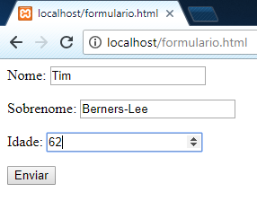
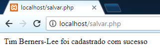
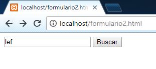
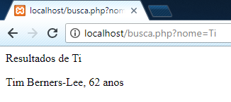
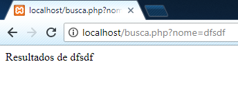

# Formulários

Uma das principais funcionalidades de uma linguagem back-end é manipular dados de formulários, salvando os dados do mesmo em um banco de dados.

Veja o exemplo a seguir de um formulário em HTML, no qual salvamos os dados no banco de dados utilizando um arquivo PHP:

```html
<!-- formulario.html ou formulario.php -->
<form method="POST" action="salvar.php">
    <p>
        <label>Nome:</label>
        <input type="text" name="nome">
    </p>

    <p>
        <label>Sobrenome:</label>
        <input type="text" name="sobrenome">
    </p>

    <p>
        <label>Idade:</label>
        <input type="number" name="idade">
    </p>

    <input type="submit" value="Enviar">
</form>
```

Existem dois métodos de formulários, o GET e o POST, o primeiro exibe as informações na url, ótimo para buscas, já o segundo não exibe as informações, ótimo para login e inserção de dados.

Ao clicar no botão **Enviar**, o navegador envia os dados inseridos no formulário para o arquivo salvar.php, no qual você por acessar com a [variável superglobal](http://php.net/manual/pt_BR/language.variables.superglobals.php) `$_POST` caso você tenha utilizado o método POST, e a superglobal `$_GET` caso você tenha utilizando o método GET, as mesmas são um array chave-valor, cujo as chaves são os `name=""` do formulário, e o valor os valores inseridos pelo usuários, veja o arquivo salvar.php a seguir:

```php
// salvar.php
$conexao = new PDO('mysql:host=localhost;dbname=php_tutorial;charset=utf8', 'root', '');

$query = $conexao->prepare('INSERT INTO tabela_teste (nome, sobrenome, idade) VALUES (:nome, :sobrenome, :idade)');

$query->bindValue(':nome', $_POST['nome']);
$query->bindValue(':sobrenome', $_POST['sobrenome']);
$query->bindValue(':idade', $_POST['idade']);

$query->execute();

echo $_POST['nome']. ' ' . $_POST['sobrenome'] . ' foi cadastrado com sucesso';
```

Note os `$_POST`, as chaves deles são os mesmos `name=""` do formulário, eles vão possuir os valores inseridos pelo usuário, veja o formulário preenchido:



Ao clicarmos em Enviar, a página a seguir será exibida:



Nosso phpMyAdmin ficará assim:


E a nossa página teste.php da página sobre o PDO ficará assim:


Lembre-se que esse é apenas um tutorial para iniciantes, cabe a você procurar por formas melhores de validação e inserção de dados, como disse antes, normalmente os frameworks te fornecem maneiras bem fáceis de fazer isso.

## Método GET

O método GET é ideal para buscas, com ele você pode ter chave-valor pela URL da página, que chamamos de query string, veja o exemplo a seguir:

```html
<!-- formulario2.html ou formulario2.php -->
<form method="GET" action="busca.php">
    <input type="text" name="nome" placeholder="Nome">

    <input type="submit" value="Buscar">
</form>
```

Código PHP que fará a busca:

```php
// busca.php
$conexao = new PDO('mysql:host=localhost;dbname=php_tutorial;charset=utf8', 'root', '');

$query = $conexao->prepare('SELECT * FROM tabela_teste WHERE nome LIKE :busca');

$query->bindValue(':busca', '%' . $_GET['nome'] . '%');

$query->execute();

echo '<p>Resultados de ' . $_GET['nome'] . '</p>';

while ($linha = $query->fetch(PDO::FETCH_ASSOC)) {
    echo $linha['nome'] . ' ' . $linha['sobrenome'] . ', ' . $linha['idade'] . ' anos' . '<br>';
}
```

O comando `LIKE` é usado normalmente para buscas, note que fazemos uma concatenação no `bindValue` com % no início e no final, isso significa que queremos resultados que possuam em qualquer parte o valor de `$_GET['nome']`, caso tiver % apenas no início, significaria que queremos apenas o que termina com o valor de `$_GET['nome']`, e se estivesse com % apenas no começo, queremos apenas o que começa com esse valor.

Agora no navegador, nosso formulário ficará assim:



Ao clicar em **Buscar**, irá para essa página:


Note o `?nome=lef` na URL, isso não ocorre quando o formulário é do tipo POST, nesse caso, `?nome=` é o campo de texto com `name="nome"` do nosso exemplo.

Note também que ele retornou o resultado cujo o campo nome do banco de dados possui "lef", por causa do % explicado anteriormente, podendo mudar manualmente o `?nome=` na URL também para realizar outra busca:



Ou uma busca sem resultados:


