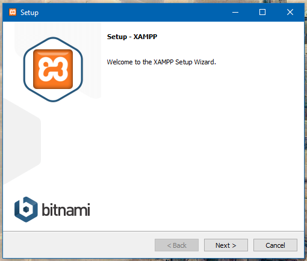
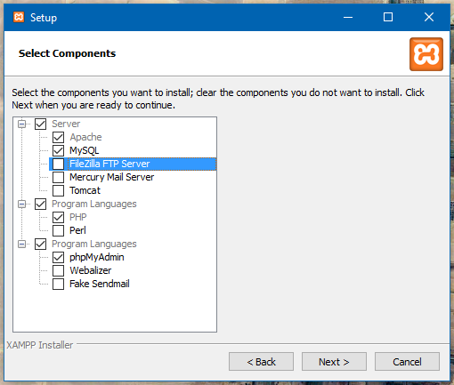
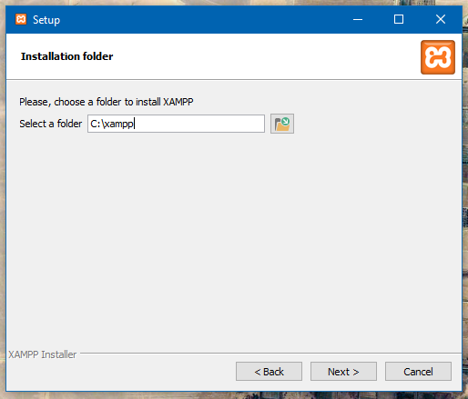
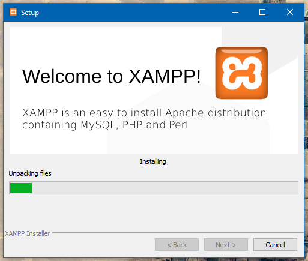
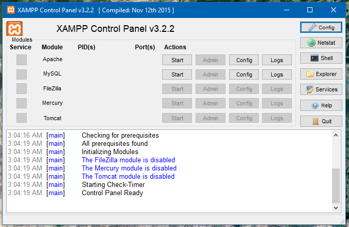
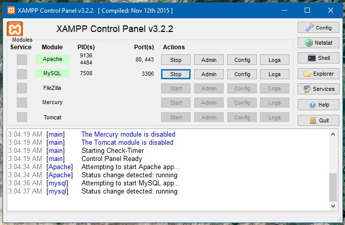
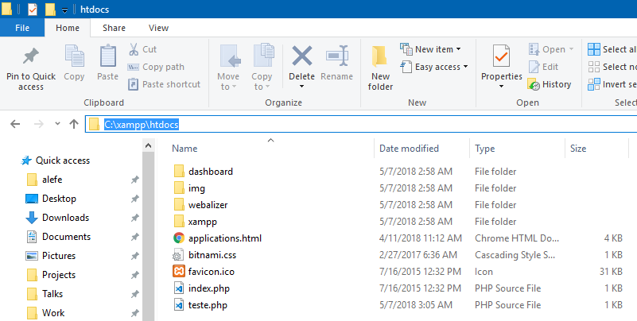
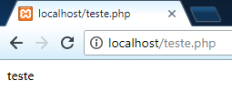

# O PHP: Iniciando

Para começar a desenvolver em PHP você precisará de um servidor local, o mais comum para iniciantes é instalar o [XAMPP](https://www.apachefriends.org), por possuir uma interface gráfica simples e fácil de usar, e já vir com o banco de dados MySQL configurado.

Ao iniciar o instalador do XAMPP, você irá se deparar com uma tela igual a essa:

Clique em Next até chegar em uma tela semelhante a esta, deixei marcado somente o que será necessário, mas caso você queira deixar todos marcados não tem problema:

Na tela seguinte, lembre-se do caminho de instalação selecionado, pois é na pasta htdocs dentro dele que colocaremos os nossos projetos:

Após ir clicando em Next, o instalador ficará alguns minutos nessa tela fazendo a instalação do PHP, Apache e MySQL:

Ao finalizar a instalação, pode deixar marcado para exibir o painel, o painel do XAMPP é igual esse:

Clique no botão Start do Apache e MySQL para iniciar o servidor dos mesmos, a tela ficará assim:

Note o número da porta, sendo 80, 443 no Apache, isso significa que você pode acessar seus arquivos PHP pelo endereço http://localhost pois a porta 80 é a porta padrão, caso estive outro número ali, como por exemplo 8000, você precisará acessar pelo endereço http://localhost:8000.

Caso você tenha selecionado a pasta C:/xampp como a pasta de instalação do XAMPP, você pode adicionar seus arquivos PHP na pasta C:/xampp/htdocs, como na imagem abaixo:

Note que eu adicionei um arquivo chamado teste.php, que eu posso acessar da seguinte forma:

Caso você seja mais avançado e goste da linha de comando, você pode baixar o PHP diretamente do [site oficial](http://php.net/downloads.php) e adicioná-lo ao seu PATH, ou através do gerenciador de pacotes do seu sistema operacioal, e então rodar o seguinte comando na pasta do seu projeto:

    php -S localhost:8000

Essas são algumas das formas de rodar o PHP localmente, caso prefira, você pode contratar uma hospedagem bem básica também, inicialmente eu utilizava o [Byethost](https://byet.host) como hospedagem para praticar, eles oferecem um plano gratuito com PHP e MySQL que você pode brincar bastante e te oferecem uma URL não muito amigável mas que você pode divulgar o que você fazer.

Você também pode comprar um domínio de internet por aproximadamente 40 reais por ano em praticamente qualquer site de hospedagem, como HostGator (eu uso), GoDaddy, Locaweb, etc, assim você pode ter uma URL tipo [https://alefesouza.com](https://alefesouza.com) por exemplo.
