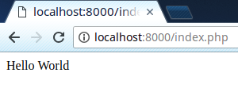

# O PHP: Sintaxe

A sintaxe do PHP inicialmente lembra bastante a do JavaScript, dificilmente usamos tipagem
e declaramos funções, segue o hello world (script mais básico) do PHP:

```php
<?php

echo 'Hello World';
```

Ao colocar esse código em um arquivo chamado index.php, gerará o seguinte no navegador:



Analisando o código acima, iniciamos com um comentário apenas para indicar que estamos editando um arquivo chamado "index.php", como você pode ver o index.php na barra de endereços da imagem acima.

* Apenas o que estiver dentro de `<?php ?>` será processado pelo PHP, o que estiver fora disso, será enviado normalmente para o navegador como HTML, caso você vá escrever apenas código PHP em um arquivo, é recomendado você não colocar o fechamento `?>`.

* Tudo que estiver após o `echo` será enviado para o navegador, pode ser um texto (string), operações matemáticas, variáveis, etc.

* Todo comando como declaração de variáveis, chamada de funções e o `echo`, deve terminar com ; (ponto e vírgula), se não terá uma mensagem de erro de sintaxe.

* Embora seja uma boa prática em todas as linguagens de programação, você não precisa deixar todo código PHP indentado assim como na linguagem Python, mas o ideal como programador é fingir que seu código não funciona caso não esteja indentado não importa a linguagem, portanto sempre indente seu código, o recomendado pela comunidade PHP é utilizar indentação de 4 espaços.

## Comentários

Comentários são mensagens que você pode deixar livremente pelo código, seja para documentar o código, marcar algo para fazer no futuro ~~ou deixar mensagens para quem for modificar o código no futuro~~, no PHP utilizamos `//` para comentários de uma linha e `/* */` para comentários com diversas linhas, exemplo:

```php
// Comentário de uma linha
echo 'Código PHP';
/*
Comentário
de
diversas
linha
*/
echo 'Código PHP';
```
